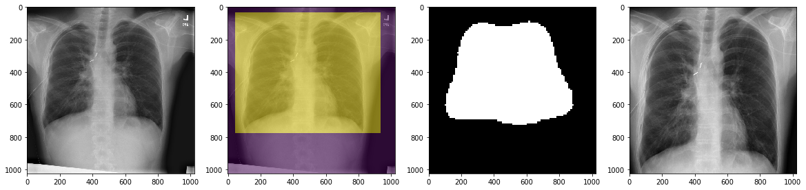
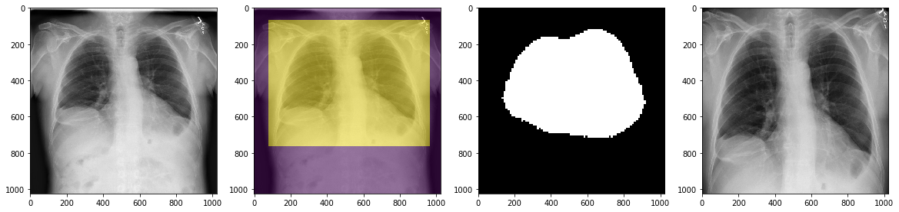
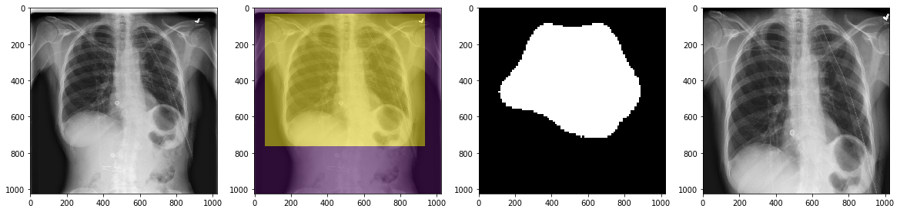
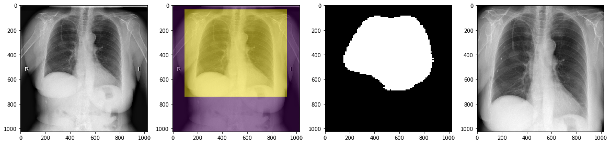

# CXRCropper
U-Net Segmentation for Cropping Chest Radiographs

## Introduction

Due to various factors, chest radiographs are sometimes suboptimal in positioning and collimation, resulting in things like offset, excessive inclusion of the neck, arms and upper abdomen and rotation.

Before I learnt about translational invariance in convolutional neural networks, I thought that removing these factors would improve the performance of any models I were to train after that - so I set about writing something that would allow me to automatically crop out everything except the lungs, heart and mediastinum from suboptimal chest radiographs.

## Instructions

Clone the repo and run the CXRCropper notebook.

Training data, test data, pre-trained model, and output folders are all included.

### Training data

CXRs are from the SiiM Pneumothorax challenge, which I converted to PNG and segmented manually using LabelBox.

The uncropped training images and corresponding uncropped training masks are in their respective folders

### Network itself

U-Net. The pretrained model was trained for 400 epochs. I think. It was a lifetime ago.

### Test data

Uncropped images are either in DICOM (uncropped_test_dicom) or PNG (uncropped_test_png)

### Test output

1. A PNG file of the cropped test DICOM/PNG is saved in cropped_test_images
2. A PNG collage of the uncropped image, cropped area, predicted mask and cropped image is saved in cropped_test_images_masks
3. The notebook will display the results as well

> ### A note about crop parameters
> The whole point of this useless exercise was to crop out the lung-heart-mediastinum to use as training images for pneumothorax segmentation in the SiiM Pneumothorax challenge.
> Therefore, if I had managed to train a pneumothorax detection model on the cropped images (I didn't manage to), I would have needed to know what was cropped so that I could "uncrop" it later for submission.

My name is Kim-Ann Git. I'm a radiologist and I'm reachable at ftsvd@yahoo.com
